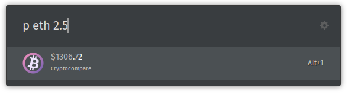

Oct. 2020  
Forked from https://github.com/bakeriogit/ulauncher-crypto to add Ulauncher V2 extension support

# ulauncher-crypto
[Ulauncher](https://ulauncher.io) extension that shows current crypto prices. 
Prices taken from the [Cryptocompare API](https://www.cryptocompare.com/).

Adapted from the [ulauncher-btc](https://github.com/noam09/ulauncher-btc) extension from [noam09](https://github.com/noam09)

## Usage
`p <ticker> <amount>`
- e.g. `p btc`, `p eth 2.5`

